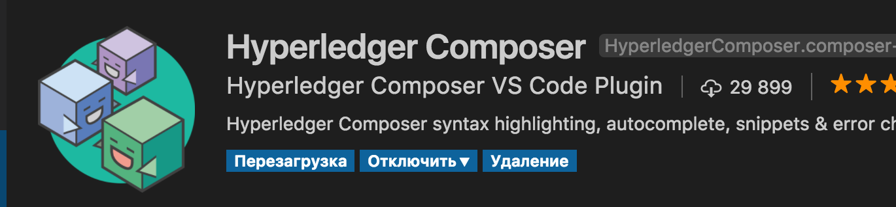

# Установка dev окружения

# Инструменты

#### Test

Перед установкой самих инструментов нужно поставить все что перечисленно по [ссылке](https://hyperledger.github.io/composer/latest/installing/installing-prereqs.html)

* Operating Systems: Ubuntu Linux 14.04 / 16.04 LTS (both 64-bit), or Mac OS 10.12
* Docker Engine: Version 17.03 or higher
* Docker-Compose: Version 1.8 or higher
* Node: 8.9 or higher (note version 9 is not supported)
* npm: v5.x
* git: 2.9.x or higher
* Python: 2.7.x

Самое актуальное описание как ставить непосредственно инструменты Hyperledger Fabric находиться [здесь](https://hyperledger.github.io/composer/latest/installing/development-tools): 

Вначале ставим инструменты доступные из командной строки (CLI).

```shell
npm install -g composer-cli
npm install -g composer-rest-server
npm install -g generator-hyperledger-composer
npm install -g yo
npm install -g composer-playground
```

Потом ставим dev окружение для Hyperledger Fabric (скрипты, которые скачают и настроют контейнеры докера для HF (Hyperledger Fabric)

```shell
mkdir ~/fabric-tools && cd ~/fabric-tools
curl -O https://raw.githubusercontent.com/hyperledger/composer-tools/master/packages/fabric-dev-servers/fabric-dev-servers.tar.gz
tar -xvf fabric-dev-servers.tar.gz
./downloadFabric.sh
```

##  Управление контейнерами

### Запуск

```shell
cd ~/fabric-tools
./startFabric.sh
```

### Добавление карточки админа

```shell
cd ~/fabric-tools
./createPeerAdminCard.sh
```

### Остановка

```shell
cd ~/fabric-tools
./stopFabric.sh
```

### Запуск песочницы

```shell
composer-playground
```

Сама песочница доступна по адресу [http://localhost:8080/login](http://localhost:8080/login)
Необходимо чтобы была как минимум одна карточка создана (хотя бы админа)

# IDE

Рекомендуется использовать [VSCode](https://code.visualstudio.com/)
После установки нужно поставить плагин для Hyperledger. Для этого

* Запустить VSCode
* Нажать кнопку Extensions
* Набрать "composer" в строке поиска
* Нажать Install рядом с плагином Hyperledger Composer 

* После установки нажать кнопку Reload 
